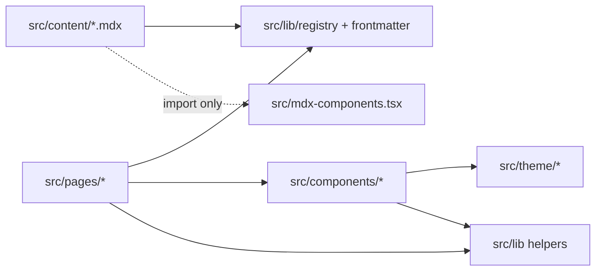
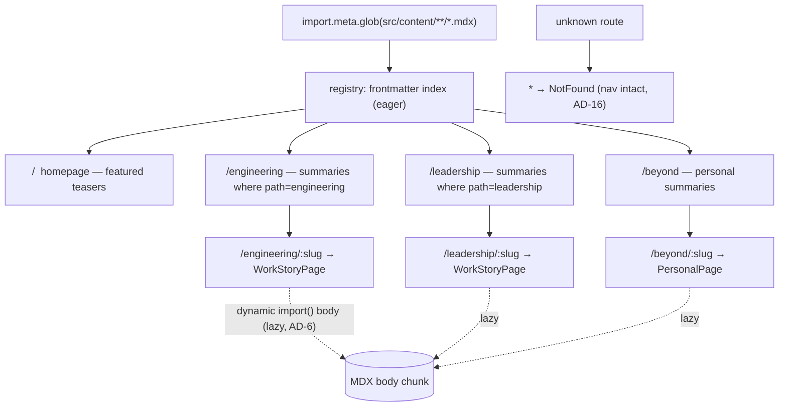
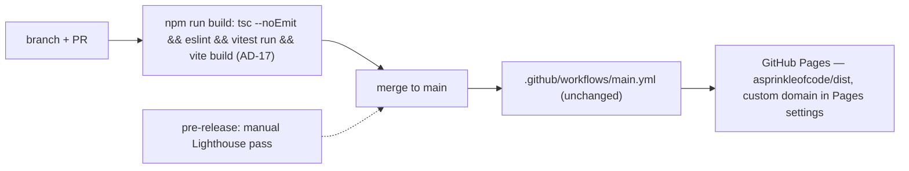

# Architecture Spine — Alisha Sprinkle Korba Portfolio

This spine fixes the invariants that keep separately built parts of the portfolio consistent. Structural detail (the source tree, the full data shape) is **seed** — accurate at authoring, owned by the code once it exists. Rationale lives in `.memlog.md`, not here.

It augments **PRD.md v0.7** at feature altitude. `DESIGN.md v0.6` and `EXPERIENCE.md v0.8` remain authoritative for their domains; this spine defers to them and never overrides them.

---

## Design Paradigm

**Layered feature-foldered SPA.** Five layers, one-way dependency flow, mapped to directories:

| Layer | Directory | Holds |
| --- | --- | --- |
| Content | `src/content/{work,personal}/*.mdx` | Portfolio stories as MDX (typed frontmatter + authored body) |
| Registry + schema | `src/lib/registry.ts`, `src/lib/frontmatter.ts` | Build-time story index, frontmatter validation, derived summary lists |
| Route pages | `src/pages/<Target>/` | One component per route target; owns data-loading from the registry |
| Shared components | `src/components/<Name>/<Name>.tsx` + `<Name>.css` | Presentational only; props in, no registry access (existing repo convention) |
| Theme | `src/theme/` (`colors.css`, `theme.css`, `aSprinkleOfCodeTheme.ts`) | CSS-variable design tokens + the flowbite theme object |

Cross-cutting helpers (`usePrefersReducedMotion`, `useDocumentMeta`, `cssVar`, `links`) live in `src/lib/`. The MDX block whitelist is `src/mdx-components.tsx`.

The app is client-only: no SSR, no backend, no runtime configuration. All story data is resolved at build time.

---

## Invariants & Rules

Stable IDs, ascending, never reused or renumbered. `[ADOPTED]` = the input contracts or existing reality already settled it.

### AD-1 — Content is MDX-per-story, two types, one pipeline

- **Binds:** every piece of portfolio content (Engineering evidence, Leadership & Enablement evidence, Beyond the Code dimensions).
- **Prevents:** divergent content representations across paths; a CMS or backend being introduced for content (PRD Non-Goal 7, C-2).
- **Rule:** each content piece is exactly one `.mdx` file with typed frontmatter + an authored body, compiled through `@mdx-js/rollup`. There are two types, discriminated by directory: `work` (`src/content/work/`, Engineering + Leadership, shares the evidence-model frontmatter and the AD-3 section menu) and `personal` (`src/content/personal/`, Beyond the Code — media-first frontmatter, freeform body, no evidence model, no story-count quota). One pipeline, two frontmatter schemas, two detail layouts. No other content store.

### AD-2 — Frontmatter is the single source of truth for summaries and publication state

- **Binds:** story authoring; every summary card, path index, and homepage teaser.
- **Prevents:** a story's summary drifting from its deep content; hand-maintained curation or teaser lists going stale.
- **Rule:** summary cards are generated entirely from frontmatter (`title`, `path`, one-liner / problem-class, `role`, `capabilities`, optional `hero`, `featured?: number`, `draft?: boolean`) — never authored as separate prose. `capabilities` values come from the controlled list in Conventions — not free text — so the Capability Signal component and any grouping stay coherent. The homepage renders the top-N stories by `featured` from the registry; there is no separate featured list. `draft: true` removes a story at the **registry/build level** — its body chunk never enters `dist`, not merely hidden at render time (PRD NFR-4 / D-12 "no placeholder content"; AD-4 public-safe). Missing or invalid required frontmatter fails the build. Index, teaser, and path surfaces render only from real registry entries — no empty-state shells for content that does not exist (EXPERIENCE §14 Missing Content). A `personal` entry with `listed: false` is reachable at its route but never appears in the `/beyond` index or a teaser: that is how a **supporting** page (the care guide) exists without becoming a third Beyond the Code dimension, which PRD D-18 excludes. `listed` is a per-file schema field, not a hand-maintained curation list — the thing this AD forbids.

### AD-3 — Deep-story sections are a loose menu with a required core

- **Binds:** `work`-type stories.
- **Prevents:** stories padded with empty sections to fill a fixed template; or, at the other extreme, two stories structured so differently they can't be scanned the same way.
- **Rule:** the evidence sections have one canonical order: Context · Problem/Ambiguity · Constraints · Ownership · Decision · Rationale · Tradeoffs · Collaboration · Outcome · Reflection. **Context, Decision, and Outcome are always present.** The other seven appear only where the story has real evidence for them (PRD §6, DESIGN §13, EXPERIENCE §11). No section is invented to complete the set.

### AD-4 — The repo is a display artifact, not just the deployed site

- **Binds:** every commit to `main` — code, content, and the planning artifacts alongside them.
- **Prevents:** half-finished or non-public-safe work being visible in a repository that is itself presented as professional work; leftover scaffolding eroding that impression; ambiguity over which planning artifacts are public.
- **Rule:** (a) `draft: true` means "not visitor-ready," **not** "scratch" — a draft `.mdx` on `main` must still be coherent, public-safe (PRD FR-20/21, C-3), and free of unfinished-note dumps or filler text; genuinely raw drafting stays on a feature branch until it is repo-presentable. (b) `main` carries no orphaned scaffolding, placeholder assets, or dead template code. The first change that touches such a file removes its leftovers (current examples: the `useState` counter in `App.jsx`, the `NavbarBrand` `href` pointing at `flowbite-react.com`, the unused `react.svg`). (c) The **finalized planning artifacts are part of the display artifact** and held to the same public-safe standard as code and content: `_bmad-output/PRD.md`, `DESIGN.md`, `EXPERIENCE.md`, `specs/`, `architecture/`, and promoted `mockups/` are committed; `.memlog.md` and `.working/` are not (`_bmad-output/.gitignore`). The mechanism is **public by default**: `_bmad-output/` is committed except for the two named exceptions, so a new artifact (`epics.md`, `stories/`, `sprint-status.yaml`, the gate's `architecture/reviews/`) is public unless it is deliberately excluded — including the reviews that criticise this spine, which is the point: a spine that visibly survived an adversarial pass is stronger evidence than one with no review behind it. "Finalized" is not a path property: a planning document is publishable when its own frontmatter says `status: final`, so an in-flight draft under a committed path is not made public by sitting there. The finished documents are themselves business-to-engineering evidence (PRD PO-2 / FR-5); the memlogs are raw working memory (PRD D-24). Accepted consequence: memlogs live only in the local working copy. Branch-and-PR only; never commit to `main` (AGENTS.md).

### AD-5 — Route table is fixed; stories are discovered, not registered

- **Binds:** routing; the act of adding a story.
- **Prevents:** a manual story registry drifting from the files; a route edit being required per story; ambiguity over which index a story belongs to.
- **Rule:** the route set is exactly `/` (homepage), `/engineering` + `/engineering/:slug`, `/leadership` + `/leadership/:slug`, `/beyond` + `/beyond/:slug`, and `*` (not-found). `HashRouter` only — never `BrowserRouter` (AGENTS.md; GitHub Pages has no history fallback). `src/content/**/*.mdx` is discovered via `import.meta.glob`; directory determines type; `slug` = filename (frontmatter `slug` may override). The registry key is the composite `type` + `path` + `slug`, so the same `slug` under `engineering` and `leadership` does not collide. Which index a `work` story appears in comes from its frontmatter `path: engineering | leadership`, not its directory. Both `work` route patterns render one shared `WorkStoryPage`; `/beyond/:slug` renders one `PersonalPage`. Adding a story = adding one `.mdx` file — no registry edit, no route edit. The route *paths* are fixed here; the header's navigation structure, placement, and visitor-facing labels remain UX-owned (EXPERIENCE §5.2, PRD D-15).

### AD-6 — Eager on frontmatter, lazy on everything else

- **Binds:** the registry; every route page.
- **Prevents:** the whole content corpus loading on first paint (PRD NFR-3).
- **Rule:** the registry eager-loads **frontmatter only** (`import.meta.glob(..., { eager: true, import: 'frontmatter' })`) to build the summary index, teasers, and path indexes. Each deep-story MDX body is a dynamic `import()` resolved on its detail route. Route page components are `React.lazy` + `Suspense`. The homepage's initial bundle is the app shell + summaries — no story bodies.

### AD-7 — One-way dependency direction

- **Binds:** all modules under `src/`.
- **Prevents:** presentational components coupling to routing or content; each index/story page inventing its own way to read frontmatter.
- **Rule:** dependencies flow one way only —



  Pages may read the registry; components never do (props only). Components never import pages. `src/theme/*` imports nothing app-level. MDX bodies import only from `src/mdx-components.tsx` (see AD-8).

### AD-8 — MDX bodies use explicit imports from a fixed whitelist

- **Binds:** every `.mdx` file; `src/mdx-components.tsx`.
- **Prevents:** content files reaching for arbitrary app components; an uncontrolled set of blocks usable inside stories.
- **Rule:** `src/mdx-components.tsx` defines and exports the sanctioned block set (e.g. `DecisionBlock`, `OutcomeBlock`, `CapabilitySignal`, `StorySection`). MDX files **import the blocks they use explicitly, per file** — no `MDXProvider` auto-injection. A block not exported from the whitelist is not available to content, and a story must not hand-roll a look-alike from raw markup where a whitelisted block exists. (Revisit only if per-file imports become a maintenance burden.)

### AD-9 — Touch-to-migrate to TypeScript, as a verified rewrite

- **Binds:** any `.js` / `.jsx` file substantively edited by this initiative; all new files.
- **Prevents:** the unchecked type surface growing; a rename being mistaken for a migration.
- **Rule:** new files are always `.ts` / `.tsx`. A `.js` / `.jsx` file that is substantively edited is migrated to `.ts` / `.tsx` as part of that change — a typed rewrite with real types (no implicit `any`), behaviour unchanged, and the result verified against `tsc --noEmit` + `eslint` + the smoke test. Untouched legacy `.jsx` may remain (`allowJs` off, `checkJs` off).

### AD-10 — Semantic design tokens only

- **Binds:** every component, page, and co-located `.css` file.
- **Prevents:** each component picking its own greys, accents, or hex values — the divergence already present in the codebase (`text-blue-600`, `text-gray-400`, raw hex).
- **Rule:** UI references **semantic role tokens only** — `--background-*`, `--text-*`, `--border-*`, `--brand-*`, `--accent-secondary*`, `--focus-ring`, `--status-*` (defined in `src/theme/colors.css`, mapped to utilities via a Tailwind v4 `@theme` block in `src/theme/theme.css`). Never a primitive ramp variable (`--color-primary-500`), never raw hex, never a raw Tailwind palette colour. The primitive ramps (`--color-primary-*`, `--color-dark-*`, including the unused light ramps kept per DESIGN §7c) are private to `colors.css`. Code that needs a colour as a JavaScript value uses the typed helper `cssVar(name: TokenName)` (`getComputedStyle` read; safe — client-only, no SSR) — it returns a documented per-token fallback when the property is unresolved (jsdom tests, first paint) so a caller never gets an empty string; there is no duplicated token-value module. `status-*` colour is never the only signal — pair it with an icon, label, or shape (DESIGN §7b, WCAG 1.4.1).

### AD-11 — New surfaces adopt the DESIGN §18a remediation values from the start

- **Binds:** newly built components; the theme token values.
- **Prevents:** new work reproducing the three known AA contrast gaps inherited from the pre-contract theme.
- **Rule:** the token values are the remediated ones: `--focus-ring` is a solid 2 px `--brand-primary` ring with a 2 px offset (not a 30 %-alpha tint); `--brand-primary-fill` is `#A73E6C`; `--accent-secondary-fill` is `#4F63D8`. Inherited components keep their current appearance until touched, then adopt these (DESIGN §18a + AD-9). `--brand-primary-fill-hover` is **OPEN**: DESIGN §18a (A3) requires a hover darker than the resting fill but names no value, and DESIGN §7 says not to invent one. An OPEN token **does not exist** — it is absent from `colors.css` and from `cssVar`'s `TokenName` union until DESIGN resolves it, so it has no fallback to document (AD-10) and cannot be referenced by accident. Until then the sanctioned interim hover is DESIGN §15's retained signature effect — the `--brand-primary` glow (`drop-shadow 0 0 6px`) — with the resting fill unchanged. No component invents a darker fill.

### AD-12 — One ambient layer, one mount point, fixed contract

- **Binds:** all ambient / decorative background visuals.
- **Prevents:** the current three-implementation split (`StarBackground`, `GradientWaves`, inline Hero sparkles); decorative visuals regressing accessibility or performance.
- **Rule:** there is one `<AmbientLayer>` component, mounted once in the app shell behind `<main>`, never imported per-page. Its contract: `aria-hidden`, `pointer-events: none`, a fixed z-index below all content, a `prefers-reduced-motion` static render path, and the app renders and reads correctly if the layer never mounts. The component may later expose a `variant` prop for per-route differences; every variant obeys this contract. `GradientWaves` and the Hero sparkle spans are folded into `<AmbientLayer>` or removed when those pages are next touched (AD-4, AD-9). The **treatment itself** (stars / waves / something new; uniform vs per-route) is deferred (see Deferred).

### AD-13 — Reduced-motion is resolved once

- **Binds:** the ambient layer; the summary → deep-story transition; any future motion.
- **Prevents:** per-feature re-implementation of reduced-motion detection, and inconsistency between features.
- **Rule:** a single `usePrefersReducedMotion` hook in `src/lib/` is the only source of that signal. The summary → deep-story transition is a ~180 ms cross-fade with selected context preserved, and instant when the hook reports reduced motion (DESIGN §16, EXPERIENCE §13). No transition gates access to content.

### AD-14 — Discoverability is served at the site/person level in static HTML

- **Binds:** `index.html`; every route page.
- **Prevents:** relying on client-side head updates (which non-JS crawlers never run) for discoverability; an SSG / prerender pipeline being added.
- **Rule:** under `HashRouter` there is one crawlable URL. FR-22 / FR-23 are met by **static `index.html`**: an expanded `Person` JSON-LD (capabilities in `knowsAbout`, `sameAs` for LinkedIn + GitHub per D-16, plus `WebSite` / `ProfilePage`), and solid default `<title>`, description, canonical, and Open Graph / Twitter-card tags. Per-route head updates via one `useDocumentMeta({ title, description, jsonLd? })` hook are **progressive enhancement only** — accurate tab titles and per-story `Article` structured data for JS-rendering crawlers, never the primary bet. The hook applies in an effect and restores the static defaults (title + any injected JSON-LD) on unmount, so story metadata never leaks across navigation. No prerender / SSG (it cannot cross the hash boundary, and it is investment the PRD's C-5 rejects). Shared deep links previewing as the site root is accepted (PRD-level decision). Deep-story organic search is an explicit non-goal.

### AD-15 — Semantic HTML baseline

- **Binds:** every page and story.
- **Prevents:** each story component structuring headings and landmarks ad hoc — which erodes both accessibility (NFR-1) and the little SEO the hash constraint allows.
- **Rule:** one `<h1>` per page, a correct heading hierarchy beneath it, `<main>` / `<nav>` / `<article>` / `<section>` landmarks, meaningful link text, and descriptive `alt` on every meaningful image (EXPERIENCE §17, DESIGN §18). `eslint-plugin-jsx-a11y` enforces the statically-checkable parts.

### AD-16 — The app never shows a blank page

- **Binds:** the app shell; all routes.
- **Prevents:** a render error or a failed dynamic `import()` (chunk load) blanking the app or stranding the visitor without navigation (EXPERIENCE §14 Error state).
- **Rule:** an app-shell React error boundary wraps the routed area, below `<Header>` and above `<Footer>`. On any render or chunk-load failure it renders a recovery fallback with navigation intact. The `*` route renders a not-found page that likewise keeps the header/nav and offers a route home.

### AD-17 — The build gate is real, and the initiative is sequenced behind it

- **Binds:** the `build` script; CI; the order of initiative work.
- **Prevents:** pre-existing violations blocking new work; unverified code reaching the live site after the baseline exists; story work starting before the toolchain that verifies it.
- **Rule:** a dedicated **"toolchain + compliance baseline" story is the first story of the initiative.** It adds `typescript` (5.x), `typescript-eslint`, `eslint-plugin-jsx-a11y`, `vitest` + `@testing-library/react`; adds `tsconfig.json` (`strict: true`, `noUncheckedIndexedAccess` off) + `tsconfig.node.json`; extends `eslint.config.js` to `**/*.{ts,tsx}`; migrates the existing `.tsx` files + `App.jsx` / `main.jsx` (per AD-9); **authors the AD-10 semantic token layer**, without which AD-10 is unbuildable — `colors.css` today holds primitive ramps only, `theme.css` does not exist, and `aSprinkleOfCodeTheme.js` still reaches past the role layer; performs the AD-4 dead-scaffolding cleanup; updates the `AGENTS.md` "lint covers only `.js`/`.jsx`" note to reflect the new `.ts`/`.tsx` coverage; and adds a light smoke test (each route renders without throwing, the registry loads, no console errors). Only when `tsc --noEmit`, `eslint`, and `vitest run` all pass clean does `build` become `tsc --noEmit && eslint && vitest run && vite build` — which the existing deploy workflow runs unchanged. The gate therefore binds at **deploy**, not at PR: there is no PR-triggered CI (adding one is infra PRD C-2 would question), so a failing gate breaks the deploy rather than blocking the merge. Pre-merge verification stays local `npm run build` + branch review. All other story-content and path-surface work sequences after this story. Performance stays a **manual** Lighthouse pass before each public release — no CI performance or bundle-size gate for MVP (see Conventions).

### AD-18 — The entry surface is self-sufficient

- **Binds:** the app shell; `pages/Landing`; `components/Header`; every exploration-path entry point.
- **Prevents:** the entry surface depending on a surface that is conditional or deferred — one builder reserving a hidden or empty Speaking slot, another omitting it; a nav entry or path card pointing at a route that does not exist.
- **Rule:** the entry surface renders complete from what already exists — it never waits on content that does not. Two things are being separated: the **three exploration paths are fixed product structure** (PRD FR-3 / D-15, routed by AD-5) and always render, whereas the *story content inside* them is registry-derived and subject to AD-2's no-empty-shell rule. A path shipping with no published stories is a content gap to fill before release (NFR-4), not a path to hide. Beyond that fixed set, no route, nav entry, path card, or teaser slot may be conditional on content that does not exist — the speaking surface (FR-18, conditional on A-13), a third Beyond the Code dimension (excluded by D-18), or the care-guide destination. Adding such a surface later is **purely additive**: it may extend the entry surface, never be a precondition for it. The person-level identity that lets an arrival from a talk recognize the site as the same person holds before any story content exists (PRD FR-24 / D-23, SPEC CAP-12). It has **one owner**: the static `index.html` head + `Person` JSON-LD (AD-14) is canonical for the identity and capability wording; the Landing identity block presents the same claim and must not state a different one. The smoke test (AD-17) asserts they agree. The surface *treatment* that satisfies this is UX-owned (EXPERIENCE UX-024) — this AD fixes only the dependency direction.

---

### AD-19 — Scroll and focus on navigation are handled once, in the shell

- **Binds:** every route change; the `Suspense` boundaries around lazy route pages and story bodies (AD-6); the sticky header's height (EXPERIENCE v0.8 §5.2).
- **Prevents:** each page inventing its own scroll and focus behaviour — one story page scrolling to top on mount and another not; focus left on a link the visitor has navigated away from; the back button landing a returning reader somewhere other than where they left; the post-navigation heading, or a future in-page anchor, landing hidden underneath the now-sticky header. `HashRouter` restores none of this by default, and the primary visitor reads deeply and navigates back (PRD D-21, UJ-2 step 5).
- **Rule:** one shell-level handler owns this; no page implements its own. On a **forward** navigation, scroll to the top of `<main>` and move focus to the new page's `<h1>` (`tabIndex={-1}`, focus styling suppressed for programmatic focus only). On a **back/pop** navigation, restore the previous scroll position. Focus and scroll settle **after** the lazy body resolves — a `Suspense` fallback never steals focus or fixes scroll against the fallback's height. Scrolling is instant, never smooth, when `usePrefersReducedMotion` reports reduced motion (AD-13). The header is sticky (EXPERIENCE v0.8 §5.2, UX-015) and stays visible above `<main>`; one shared `--header-height` custom property — set at a shared ancestor scope (`:root` or the app shell, never per-page) to the sticky bar's own rendered height, overridden at the same scope by a breakpoint media query if that height differs on mobile — drives `scroll-padding-top` on the routing root so "top of `<main>`" and the focused `<h1>` land below the header rather than beneath it, and drives `scroll-margin-top` on any future in-page anchor target. No page or anchor computes its own offset.

### AD-20 — In-portfolio documents are frontmatter-declared static assets, never outbound links

- **Binds:** `personal` content frontmatter; the `listed: false` supporting-page pattern AD-2 already establishes; any surface offering a document hosted within the portfolio rather than linked externally (PRD A-12, the Birdhouses care guide).
- **Prevents:** a same-origin document being folded into `personal.links` and inheriting the outbound "leaves the site" treatment (`target="_blank"`, `rel="noopener noreferrer"`, visible leaving-the-site affordance, or a forced `download` attribute) that Conventions reserves for genuinely external destinations; reaching for a server-rendered or dynamically-generated document path that GitHub Pages' static hosting cannot serve; two builders each independently AD-compliant but structurally incompatible — one attaching the PDF to the Birdhouses dimension's own entry, the other giving it a separate hidden entry.
- **Rule:** the care guide is exactly the `listed: false` `personal` entry AD-2 already describes (its own `.mdx` file, own route, reachable but absent from `/beyond` and every teaser) — **not** a field merged onto the Birdhouses dimension's own entry. That entry's frontmatter carries a new optional `pdf?: string` field naming a static asset path under `public/downloads/<slug>.pdf` — served directly by GitHub Pages, zero backend, consistent with the existing no-server/no-runtime non-goals (AD-4, Non-goals). Rendering is a plain same-origin `<a>` whose `href` is the frontmatter `pdf` value, with **no** `target="_blank"`, **no** `rel`, and **no** `download` attribute — those all belong to the outbound-link convention and a `download` attribute in particular would force a save-to-disk prompt instead of the in-browser preview this rule requires. That same link already satisfies "viewable" (Chrome/Firefox/Safari/Edge render a linked or embedded PDF inline by default), and the page may additionally embed the same asset via `<iframe>`/`<object src>` with an accessible name/fallback text (AD-15) for an in-page preview. A PDF.js-style viewer library is not required for MVP — deferred if a custom in-page reader is wanted later (see Deferred). Mobile rendering varies (Chrome-Android may force a download instead of inline view; iOS Safari's embedded view shows only the first page until expanded) — the plain link stays the reliable path regardless; an `<iframe>`/`<object>` embed is a desktop-grade enhancement, not the sole access path. `personal.links` stays reserved for genuinely external destinations (the making Instagram). Once committed, the file is an asset like any other under `public/` — a corrected revision may replace it in place (it is a document, not a photo or video, so AGENTS.md's narrower photo/video protection doesn't bind it, though the same "don't casually remove what's there" spirit applies). **Note:** PRD A-12 (2026-09-12) is the authoritative, most-recent resolution this AD implements; `EXPERIENCE.md` v0.8 §9.3/§13's care-guide wording ("a lightweight page… external link acceptable") predates it and is stale — flagged for `bmad-ux` to reconcile, not corrected here.

---

## Consistency Conventions

| Concern | Convention |
| --- | --- |
| File / component naming | Component per folder: `src/components/<Name>/<Name>.tsx` + `<Name>.css`. Route targets: `src/pages/<Target>/<Target>.tsx`. Content files: kebab-case slug `.mdx`. Helpers: `src/lib/<camelCase>.ts`. |
| Frontmatter keys | `work`: `type`, `title`, `path` (`engineering`\|`leadership`), `slug?`, `summary` (one-liner), `role`, `capabilities: Capability[]`, `date?`, `hero?`, `featured?: number`, `draft?: boolean`. `personal`: `type`, `title`, `slug?`, `summary`, `date?`, `hero?`, `links?: { label, href }[]`, `pdf?: string` (static asset path, AD-20), `featured?: number`, `draft?: boolean`, `listed?: boolean` (default `true`). Unknown keys rejected by the schema. |
| Downloadable / viewable documents | Static assets only, under `public/downloads/<slug>.pdf`, referenced via `pdf` on a dedicated `listed: false` `personal` entry (AD-20, AD-2) — never merged onto the dimension's own entry, never a `personal.links` item. Plain `<a href>`, no `target`/`rel`/`download`; optional inline `<iframe>`/`<object>` preview with an accessible name (AD-15). No server, no PDF-viewer dependency for MVP. |
| Capability vocabulary | `capabilities` draws from one controlled union, aligned to PRD D-4 / the evidence model: `business-to-engineering`, `ownership`, `engineering-judgment`, `ambiguity`, `enablement`. Extending the list is a deliberate edit to `frontmatter.ts`, not an ad-hoc string. |
| Index ordering | A path index lists `featured` stories first (ascending `featured`), then the rest by `date` descending, then by `title`. Ties *within* the featured set fall through to the same `date` descending, then `title` tie-break — ordering is total, so two surfaces never order the same stories differently. Same rule for homepage teasers. |
| Colour & tokens | Semantic role tokens only (AD-10). `status-*` always paired with a non-colour cue (AD-10). |
| External URLs & outbound links | URL literals only — in content frontmatter (`personal.links`) or `src/lib/links.ts`. No secrets, no `.env`, no runtime config (see Non-goals). `index.html` already carries the real GitHub and LinkedIn `sameAs` URLs — ratify those, don't re-ask. Only the Instagram handles are still pending from Alisha (PRD A-14) — do not invent them. Every outbound link opens with `target="_blank"` + `rel="noopener noreferrer"` and a visible "leaves the site" affordance (EXPERIENCE §13). |
| Images | Explicit `width`/`height` (CLS), `loading="lazy"` below the fold, `webp`/`avif`, sized to display. Never modify or delete existing media in `src/assets/` or `public/` (AGENTS.md) — add only. |
| Third-party embeds (YouTube, Google Drive) | Click-to-load facade (poster + play control; real `<iframe>` only on interaction). Never auto-loaded, never on the homepage. |
| Errors & state | No state library — router + local component state + the flowbite `ThemeProvider` only. Error handling per AD-16. |
| Motion | Reduced-motion via `usePrefersReducedMotion` only (AD-13). No transition may gate content access. |
| Accessibility | WCAG 2.2 AA target. Pointer targets ≥ 24 × 24 CSS px (SC 2.5.8). Visible focus per AD-11. Verified by `jsx-a11y` + a manual keyboard/contrast pass + Lighthouse (Accessibility in the 90s). |
| Performance | Lazy-load route pages and story bodies (AD-6). ~175 KB gzip initial JS is a **non-binding watch line** — crossing it prompts a look at *why*, nothing fails. Homepage LCP target < 2.5 s on throttled mid-tier mobile. `build:analyze` (`rollup-plugin-visualizer`) available on demand. |
| Branching | Work on a branch, open a PR, never commit to `main` (AGENTS.md). |

---

## Stack

Seed — verified current September 2026; the code owns the pins once they exist. New additions are marked; everything else is ratified from `asprinkleofcode/package.json`.

| Name | Version | Note |
| --- | --- | --- |
| Vite | ^7.0 | ratified |
| React / react-dom | ^19.1 | ratified |
| react-router | ^7.9 | ratified — v8 exists; not upgrading in this initiative |
| Tailwind CSS / @tailwindcss/vite | ^4.1 | ratified; CSS-first config (`@theme`) |
| flowbite-react | ^0.12 | ratified — the component library (AGENTS.md); do not hand-roll equivalents. Still pre-1.0 (0.12.17, unchanged since 2026-02) — a breaking minor is the expected risk of the adoption. |
| react-icons | ^5.5 | ratified — per-icon imports |
| eslint | ^9.30 | ratified — flat config. 9.x is a deliberate **ceiling**, not staleness: ESLint 10 is current, but `eslint-plugin-jsx-a11y` 6.10.2 peers only `^9`. |
| @vitejs/plugin-react | ^4.6 | ratified — the MDX `enforce: 'pre'` ordering depends on it. **Do not `@latest` it** in the baseline story: 6.x peers `vite ^8`, which would force the deferred Vite major. |
| @mdx-js/rollup | ^3.1 | **new** — MDX pipeline; `enforce: 'pre'` before `@vitejs/plugin-react`; ESM-only |
| typescript | ~5.9 | **new as a direct dep** — stay on 5.x. Not 7.x (no stable programmatic API until TS 7.1; typescript-eslint + MDX tooling incompatible). Not 6.0 either, though `typescript-eslint` 8.70 does peer it (`<6.1.0`): `@mdx-js` compatibility with 6.0 is unverified, and the repo already resolves 5.8.3 — 5.9 is the smallest step that gets a real toolchain running in the first story. Both upgrades deferred to the same trigger. |
| typescript-eslint | ^8.70 | **new** — lints `.ts`/`.tsx` |
| eslint-plugin-jsx-a11y | ^6.10 | **new** — static accessibility rules |
| vitest / @testing-library/react | ^5.0 / ^16.3 | **new** — light smoke test only |
| rollup-plugin-visualizer | ^7.1 | **new**, dev-only — on-demand bundle analysis |

---

## Structural Seed

The code owns the detail; this is scaffold at cold-start.

### Source tree

```text
asprinkleofcode/
  index.html                 # static <head>: Person/WebSite JSON-LD, OG/Twitter defaults (AD-14)
  public/
    downloads/*.pdf           # in-portfolio documents (e.g. Birdhouses care guide), static assets (AD-20)
  tsconfig.json  tsconfig.node.json
  src/
    main.jsx  → main.tsx      # entry + HashRouter (migrated, AD-9)
    App.jsx   → App.tsx       # route table, ThemeProvider, <AmbientLayer>, error boundary
    mdx-components.tsx         # sanctioned MDX block set (AD-8)
    content/
      work/*.mdx               # Engineering + Leadership stories (path: in frontmatter)
      personal/*.mdx           # Beyond the Code dimensions
    lib/
      registry.ts              # import.meta.glob loader, derived summary index (AD-5, AD-6)
      frontmatter.ts           # work | personal schemas, build-time validation (AD-2)
      links.ts                 # external URL literals
      usePrefersReducedMotion.ts   useDocumentMeta.ts   cssVar.ts
    pages/
      Landing/  Engineering/  Leadership/  Beyond/  WorkStory/  Personal/  NotFound/
    components/
      Header/  Footer/  AmbientLayer/  ErrorBoundary/
      story/ (SummaryCard, StorySection, DecisionBlock, OutcomeBlock, CapabilitySignal)
    theme/
      colors.css               # primitive ramps + semantic role layer (AD-10)
      theme.css                # Tailwind @theme mapping role → utilities
      aSprinkleOfCodeTheme.js → .ts   # flowbite theme object, role tokens only
```

### Route → content resolution



### Build & deploy



Single environment (production). No staging or PR-preview environment. Pre-merge verification is local `npm run build && npm run preview` + branch review; `README.md` documents `install / dev / build / preview` (AD-4).

**Operations envelope:** static asset hosting only — no server, no runtime, no database, no scheduled jobs. Nothing to log, monitor, or alert on beyond GitHub's own build/deploy status and the pre-release Lighthouse pass. Rollback = revert the commit on `main` (redeploys automatically). No error-tracking service (would be added infra the PRD's C-2 would question).

---

## Capability → Architecture Map

| PRD capability | Lives in | Governed by |
| --- | --- | --- |
| FR-1..3 Landing, identity, exploration paths | `pages/Landing`, `components/Header` | AD-5, AD-15, DESIGN §6.2–6.3 |
| FR-4..8 Engineering evidence | `content/work/*` (`path: engineering`), `pages/WorkStory`, `components/story/*` | AD-1, AD-2, AD-3, AD-8 |
| FR-9..11 Leadership & Enablement evidence | `content/work/*` (`path: leadership`) | AD-1, AD-2, AD-3 |
| FR-12..14, FR-19 Beyond the Code + personal continuation | `content/personal/*`, `pages/Personal` | AD-1, AD-2, `personal.links`, AD-20 (`personal.pdf` — Birdhouses care guide, PRD A-12) |
| FR-15 Summary → depth | `lib/registry`, path index pages, cross-fade transition | AD-2, AD-6, AD-13 |
| FR-16 Evidence over claims | `components/story` (DecisionBlock, OutcomeBlock) | AD-3, AD-8 |
| FR-17 Professional continuation | `lib/links`, `components/Footer` | Conventions (external URLs) |
| FR-18 Speaking | — | Deferred (conditional; PRD A-13) — additive only, never a precondition (AD-18) |
| FR-20/21 Public-safe storytelling | `draft` rule + review | AD-4 |
| FR-22/23 Discoverability | `index.html`, `lib/useDocumentMeta`, semantic markup | AD-14, AD-15 |
| FR-24 Entry context (post-talk arrival) | `index.html` identity + `pages/Landing`, `components/Header` | AD-18, AD-14, AD-2 |
| NFR-1 Accessibility (WCAG 2.2 AA) | tokens, `jsx-a11y`, semantic markup, Lighthouse | AD-10, AD-11, AD-15, AD-17 |
| NFR-2 Responsive | components (hierarchy is UX-owned, EXPERIENCE §15) | Conventions |
| NFR-3 Performance | lazy-loading, facade embeds, manual Lighthouse | AD-6, Conventions (performance) |
| NFR-4 Production quality | build gate + `draft` flag | AD-4, AD-17 |
| NFR-5 Reduced motion | `usePrefersReducedMotion`, `<AmbientLayer>`, shell scroll handler | AD-12, AD-13, AD-19 |

---

## Deferred

| Item | Why it can wait | Revisit when |
| --- | --- | --- |
| Ambient-layer **treatment** (stars / waves / new; uniform vs per-route) | DESIGN §16 / EXPERIENCE §14 hand it to implementation under fixed constraints; cheap to change behind the `<AmbientLayer>` boundary (AD-12); blocks no story work. Design goal: "something visual and engaging." | A design/Stitch exploration (DESIGN §22) lands a direction. |
| Media-dependent performance numbers (image budgets, concrete bundle ceiling) | PRD A-8 defers until final content/media strategy exists. Guardrails are set (AD-6, Conventions). | Media strategy for the making dimension + story imagery is decided (PRD §14.3 #8). |
| `frontmatter.ts` validation mechanism (hand-rolled guard vs `zod`) | Schema is tiny; either works; low-dependency ethos leans hand-rolled. Not a divergence risk — the schema shape is fixed in Conventions. | The baseline story implements it. |
| Custom in-page PDF viewer (PDF.js-style library) for the Birdhouses care guide | AD-20's direct-link / `<iframe>`-`<object>` approach already satisfies "downloadable" and "viewable" with zero new dependency; a richer in-page reader is a nice-to-have, not required for MVP. | The plain static-asset preview proves insufficient in practice. |
| Speaking surface (FR-18) | Conditional — no public-safe material yet (PRD A-13). When built, it is another `personal`-adjacent surface or a small dedicated page under the same rules, added on top of a complete entry surface (AD-18). Post-talk arrivals are served by FR-24 meanwhile, which does not wait on it (PRD D-23). | Public-safe speaking content exists. |
| TypeScript 6.0 / 7.x upgrade | TS 6.0 is inside `typescript-eslint`'s peer range but unverified against `@mdx-js`; TS 7.0 has no stable programmatic API; `typescript-eslint` closed TS 7 support as *not planned* and `@mdx-js` cannot consume it yet. | TS 7.1 stable (scheduled 2026-11-24) and `typescript-eslint` support landing on it. |
| CI performance / bundle-size gate | MVP uses a manual Lighthouse pass (AD-17); a CI gate is infra the PRD's C-2 / C-5 would question. | Repeated regressions make manual checking unreliable. |
| `react-router` 8.x upgrade | Repo is on 7.x and it works; upgrading is out of this initiative's scope. | A dependency or security reason forces it. |
| MDX plugin on a future Vite major | Vite 8 moves to Rolldown, so `@mdx-js/rollup` is a **swap, not a removal** — the successor `@mdx-js/rolldown` is still unreleased (mdx-js#2671). MDX has never had built-in Vite support at any version. Not worth a Vite-major bump now. | `@mdx-js/rolldown` ships, or the repo has another reason to move to Vite 8. |

### Non-goals (explicit)

Content CMS or backend · analytics of any kind for MVP (PRD counter-metrics) · `.env` / secrets / runtime configuration · internationalisation · SSR or static prerendering · switching off GitHub Pages or `HashRouter` · deep-story organic search discoverability.
